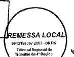

e este por um procedo de construçã

PODER JUDICIÁRIO FEDERAL

justiça do trabalho -  4ª região RIO GRANDE DO SUL
16ª VARA DO TRABALHO DE PORTO ALEGRE
Av. PRAIA DE BELAS, 1432/PREDIO II, Bairro MENINO DEUS, PORTO ALEGRE-RS, CEP 90100-000, Fone 32552016, email: varapoa_16@trt4.jus.br rem,local c/comprov.  20g

Ao Sr(a).  Zanprogna S.A.

Endereço: AV DOS ESTADOS, 2350, Bairro NAVEGANTES
Cidade: PORTO ALEGRE-RS CEP: 90200-001 Processo nº: 000515-68.2011.5.04.0016  Ação Trabalhista - Rito Ordinário Reclamante: Douglas Bersch Reclamada:  Zanprogna S.A.

AUDIÊNCIA: 04/07/201 às 14h00min Pelo presente, fica V. Sa. notificado a comparecer, no dia e hora acima indicados e no endereço que encabeça esta notificação, à audiência designada nos autos do processo supra idêntificado,  pessoalmente, caso detenha a condição de reclamante, podendo fazer-se representar por preposto, se reclamado, sendo passível, no caso de ausência, das seguintes cominações, na forma do artigo 844 da CLT:
a) se reclamante: arquivamento do processo b) se reclamado: revelia e confissão quanto aos fatos alegados pelo ATOR
Porto Alegre, 09 de maio de 2011 Expedida em 16/05/2011 i Carmem R M Scherer, Técnico Judiciário.

Em anexo cópia da inicial.